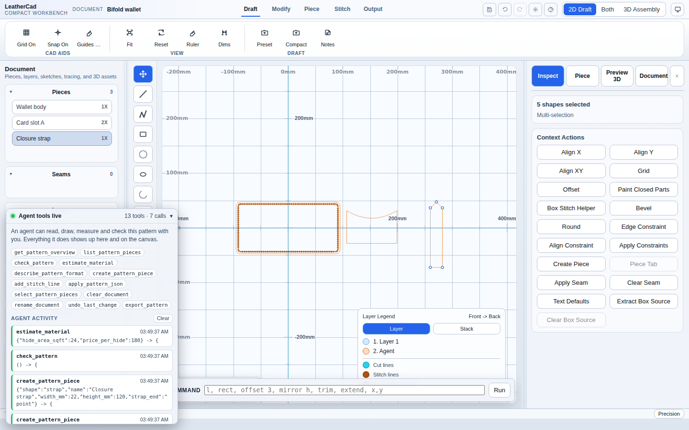

# LeatherCad

A web-based 2D CAD tool for leathercraft pattern design, built with React, TypeScript, and Vite.

## Features

- 2D pattern editor with shapes, bezier curves, and text
- Constraint solver for parametric dimensions
- Pattern grading
- Geometry import: JSON, LCC, and SVG
- Pattern PDF import (**Output → Pattern PDF**): reads a published template sheet as pieces, stitch runs, seams, and folds
- Tracing import (reference overlays only, not editable geometry): raster images and PDF
- Export: SVG, PDF, DXF, JSON, and LCC
- 3D preview via Three.js
- Template and leather catalog management
- Stitch hole rendering and cut line tools
- Nesting layout optimization
- **[WebMCP agent tools](docs/WEBMCP.md)**: the page publishes thirteen tools to
  `document.modelContext`, so an agent can draw, measure, check and cost a
  pattern alongside you

## Getting Started

LeatherCad consumes the shared [Atelier](https://github.com/ahzs645/atelier) CAD editor
runtime as a sibling checkout through pnpm `link:` dependencies — the same setup Seamer
Studio uses. Clone both repositories next to each other:

```bash
git clone https://github.com/ahzs645/atelier.git
git clone https://github.com/ahzs645/LeatherCad.git
cd atelier && pnpm install && cd ../LeatherCad
pnpm install
pnpm dev
```

Open [http://localhost:5173](http://localhost:5173) in your browser.
See [`docs/ATELIER.md`](docs/ATELIER.md) for how the engine is consumed and the
staged adoption plan, [`docs/FOLD_DRAPE_FOLLOW_UPS.md`](docs/FOLD_DRAPE_FOLLOW_UPS.md)
for what the simulated fold has shipped and what is still open on it, and
[`docs/SEAMER_FOLD_KERNEL_UPSTREAM.md`](docs/SEAMER_FOLD_KERNEL_UPSTREAM.md)
for the two engine defects that port owes upstream.

## Agent tools (WebMCP)

LeatherCad is an agent-native app. Opened in ChatGPT's in-app browser — or in
Chrome with `chrome://flags/#enable-webmcp-testing` enabled — it registers
thirteen tools with `document.modelContext`, and an agent can work on the same
pattern you are looking at: creating pieces from dimensions, punching stitch
runs, measuring resolved geometry, checking whether the pattern can actually be
cut, sewn and folded, costing the hide and thread, and exporting a cut file.

Every call it makes is listed in the Agent tools panel in the bottom-left
corner, with its arguments and its result, and its new geometry becomes the
canvas selection — so nothing happens to your document out of sight.

In a browser without WebMCP the app is unchanged, and the panel says so.



See [`docs/WEBMCP.md`](docs/WEBMCP.md) for the tool reference and how it is
implemented.

## Native AI Agent

LeatherCad can also run as a Node-served app with a native live AI Builder agent:

```bash
pnpm agent
```

This builds the app, serves `dist/`, and enables the AI Builder's **Native Live Agent** panel. Without `OPENAI_API_KEY`, it streams deterministic local leather-template drafts for testing the live canvas loop. With `OPENAI_API_KEY`, the server also asks the configured OpenAI model to refine the local draft before the final preview.

After a build, the same server can be started directly:

```bash
pnpm agent:serve -- --port 4177
```

The package exposes a `leathercad` bin, so local `npx`/package-runner workflows can start the same server entrypoint.

## Scripts

| Command | Description |
|---------|-------------|
| `pnpm dev` | Start development server with HMR |
| `pnpm build` | Type-check and build for production |
| `pnpm agent` | Build and run the Node native AI agent server |
| `pnpm agent:serve` | Serve an existing build with the native AI agent server |
| `pnpm preview` | Preview the production build |
| `pnpm lint` | Run ESLint |
| `pnpm test` | Run tests |
| `pnpm test:ai-builder-benchmarks` | Validate AI Builder swarm benchmark outputs |
| `pnpm render:ai-builder-benchmarks` | Render swarm benchmark outputs into PNG/HTML previews |
| `pnpm pattern:pdf <file.pdf>` | Import a pattern PDF into an assembled project |
| `pnpm test:watch` | Run tests in watch mode |
| `pnpm test:e2e` | Run the Playwright browser suite (a local gate, not CI) |

## Tech Stack

- **React 19** with TypeScript
- **[Atelier](https://github.com/ahzs645/atelier)** shared CAD editor runtime (`@atelier/*`, consumed as sibling source)
- **Vite** for bundling and dev server
- **Three.js** for 3D preview
- **Vitest** with happy-dom for testing
- **clipper-lib** for polygon boolean operations
- **opentype.js** for font parsing
- **pdfjs-dist** for PDF import

## License

MIT — see [`LICENSE`](LICENSE).

## Deployment

Automatically deployed to GitHub Pages on push to `main` via GitHub Actions.
